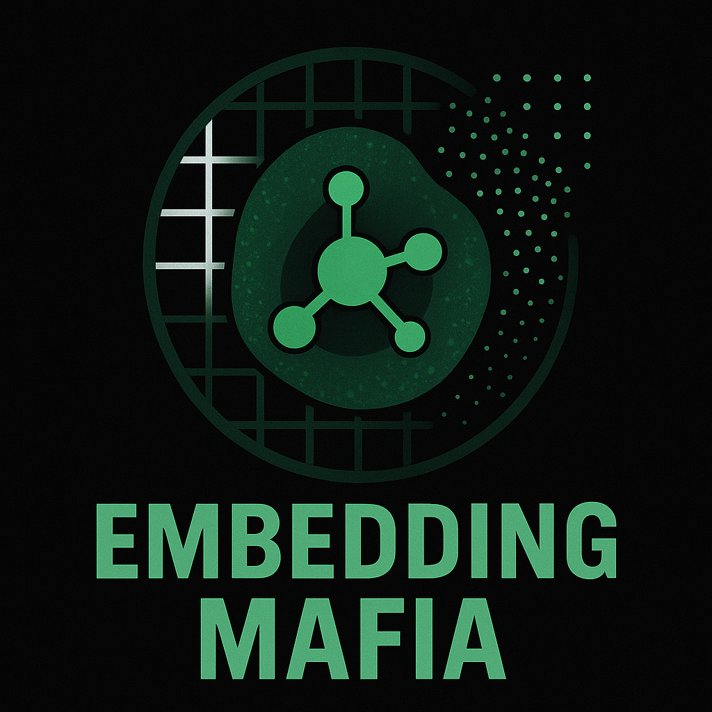

# 2025 [CM4AI](https://cm4ai.org/) Hackathon at UAB



This repo is related to the participation in 2025 CM4AI [Hackathon at UAB](https://www.uab.edu/medicine/informatics/news-events/events/cm4ai-codefest-at-uab)

---
# Day 1 (9AM-5PM)

Some suggested projects:
1. Embedding
2. Building community network and hierarchy > classic louvain algorithm 
3. Visible Neural Networks (VNN)

Provided compute power ([TACC by The University of Texas at Austin](https://accounts.tacc.utexas.edu/)):

`$ ssh username@frontera.tacc.utexas.edu`

### Our Team (`Embedding Mafia`)
- Arash Abadi (UAB)
- Morgan Smith (UT Health San Antonio)
- Rebecca Bernal (UT Health San Antonio)
- Jedediah Smith (UAB)
- Mona Shabana (UAB)

### Selected Project: 
We are going to Implement alternate image embedding method `SubCell` for immunofluorescence images:
- [SubCell Preprint](https://www.biorxiv.org/content/10.1101/2024.12.06.627299v1)
- [The code necessary for inference(SubCellPortable)](https://github.com/czi-ai/SubCellPortable)
- [CZI Documentation](https://virtualcellmodels.cziscience.com/model/subcell)
- [CZI Demo on SARS-CoV-2(subcell-tutorial)](https://virtualcellmodels.cziscience.com/tutorial/subcell-tutorial)

### Let's run IF tutorial and then subcell

1. First try [cm4ai-tutorial-immunofluorescence/](https://github.com/CM4AI/cm4ai-tutorial-immunofluorescence/])
we should download 11GB data IF images in RO-Crate format

we downloaded by python src/download.py

2. SubCell requires segmented images of cells , so we are going to perform cell segmentaiton by the same tool they used for preparing their data to train their model. HPA Cell Segmenation

- Try HPA Cell Segmenation > reuqires cuda toolkit (NVIDIA GPU) >> Run on TACC or Cheaha

- at [HPA Cell Segmentation github](https://github.com/CellProfiling/HPA-Cell-Segmentation)
 Clone > conda env create -f environment.yml > sh install.sh

Hpacellseg should be run as a python script.

---
# Day 2 (9AM-5PM)

I have to connect my github account to TACC / shift to cheaha / use wget or curl to download the prepared code from github into TACC.
I will go with wget raw file (python script to run hpacellseg) from github.

### Prepare testing data to run hpacellseg
1. connect to TACC via ssh
2. idev > 3 (default)
3. cd $WORK
4. cd ./analysis
5. bash `data_transfer.sh` to transfer 10 images to copy 10 images from "cm4ai-tutorial-immunofluorescence-main/data/raw/paclitaxel/blue" to "./data/"
6. conda activate hpacellseg

### Run hpacellseg > crop images > run subcell
1. python ./run_hpa_segmentation.py
> it will generate a directory called `segmentation_results` in the same directory of analysis 

2. I will transfer the results into my local machine (MacBook) via scp command

```bash
#Transfer the results into my local machine (MacBook) via scp protocol
hostname #(should be local machine)
cd ~
scp -r USERNAME@frontera.tacc.utexas.edu:/work2/10900/USERNAME/frontera/analysis/segmentation_results ~/tacc  # tacc is a testing directory in my local machine

```

3. Now let's prepare the data for input of subcell

    ### ***[Access Data](https://github.com/arashabadi/cm4ai_codefest2025/tree/main/data)***

    > We have selected 10 first images from paclitaxel channels (related to [cm4ai-tutorial-immunofluorescence/](https://github.com/CM4AI/cm4ai-tutorial-immunofluorescence/)) for hpacellseg input.


4. Run hpacellseg (Rebecca)

    https://github.com/Bayes-Student1/CM4AI-Group-Project-

5. prepare cropped images for subcell input (Morgan)

    https://github.com/morgansmith27

6. Run subcell (Jedediah)

   https://github.com/OriginalBrick/cm4ai-codefest


## What we’ll be working on for the next few days.
- Morgan: Cropping and subcellular visualization on the stacked images (all colors on new dataset) via Google Colab (possibly Visual Studio Code)
- Jebediah: Subcell tutorial working to change data
- Rebecca: Currently rerunning the segmentation and renaming the files
VS Code
- Arash: Project management and github maintanence
- Mona: Background/Significance for powerpoint
* Editing google slides/powerpoint for everyone

---
# Acknowledgments

We would like to thank the following people who provided significant assistance and support throughout these two days:

- [Wade Schulz](https://medicine.yale.edu/profile/wade-schulz/) (Yale)
- [Thomas Durant](https://medicine.yale.edu/profile/thomas-durant/) (Yale)
- [Christopher Churas](https://idekerlab.ucsd.edu/lab-members/) (IDEKER LAB, UCSD)
- Erin

---
# My extra notes:
- [CM4AI Data - Functional Analysis with CRISPR/PerturbSeq](https://www.youtube.com/watch?v=7RaOyiLi2cQ)

Perturbation Correlation Network

1. For each perturbation, compute the mean of all cells (perturbation mean)
2. Compute the pairwise Pearson correlation matrix of perturbation means
3. Use UMAP on the correlation matrix to visualize which perturbations correlate similarly

> cells that are cluster each other will have similar perturbation means -> results in similar cell phenotype after those perturbations

- [CM4AI Data - Immunofluorescence (IF)](https://www.youtube.com/watch?v=Ys5rFvMMtE4)

- [CM4AI - VNN](https://cellmaps-vnn.readthedocs.io/en/latest/)


To install CellMaps Pipeline:

```bash
conda create -n cm4ai python=3.8
conda activate cm4ai
pip install cellmaps_pipeline
```

Docs:
- [CellMaps Pipeline](https://cellmaps-pipeline.readthedocs.io/en/latest/)

DenseMap (?)> IF embading maker
